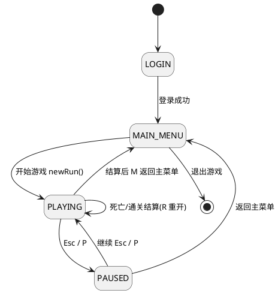
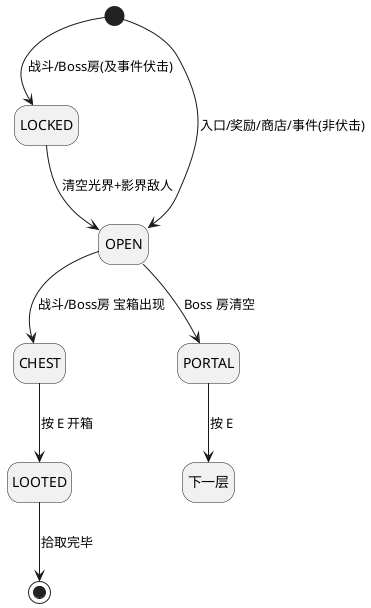
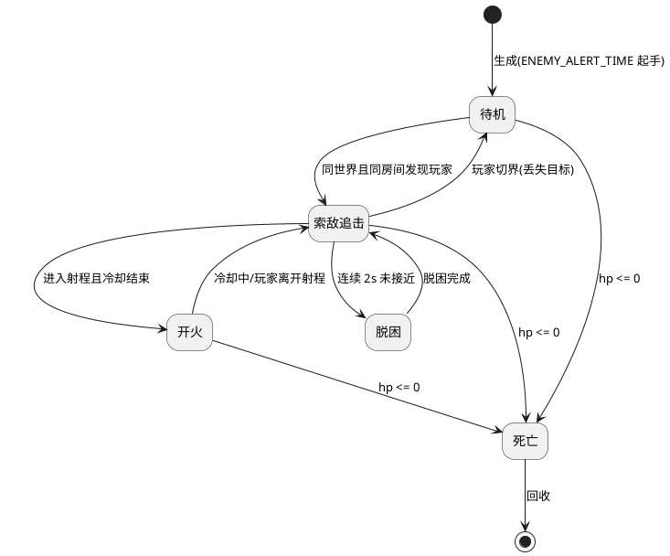

# 状态机图与状态转移表

> 状态依据：`src/main/java/com/phantomcorridor`（`core/GameState`、`model/room/Room`、`model/entity/Enemy`、`model/combat/EnemySystem`）
> 图采用 UML 状态机图（PlantUML 语法，可在 PlantUML / IntelliJ / VS Code 插件中渲染）。

---

## 1. 主状态机：应用/场景状态（GameState）

### 1.1 状态说明

| 状态 | 含义 | 进入方式 | 退出方式 |
| --- | --- | --- | --- |
| `LOGIN` | 应用启动后首个界面 | 启动默认 | 登录成功 |
| `MAIN_MENU` | 登录后主菜单 | 登录成功 / 暂停返回 / 结算返回 | 开始游戏 / 退出 |
| `PLAYING` | 游戏中，主循环驱动 | 主菜单「开始游戏」/ 暂停恢复 | 暂停 / 结算后返回 |
| `PAUSED` | 暂停覆盖层，游戏循环冻结 | 游戏中 Esc/P | 继续 / 返回主菜单 |
| `GAME_OVER` | 结算（预留占位，未实际启用） | — | — |

> 说明：`GAME_OVER` 仅为预留枚举常量（[GameState.java](file:///d:/rouge/rouge/src/main/java/com/phantomcorridor/core/GameState.java#L32-L33)）。实际「死亡/通关结算」以 `PLAYING` 状态内的渲染覆盖层呈现，不单独占用场景状态。

### 1.2 状态转移表

| 当前状态 | 事件/条件 | 目标状态 | 动作（落点） |
| --- | --- | --- | --- |
| `LOGIN` | 登录成功 | `MAIN_MENU` | `LoginController` → `App.showMainMenu()` |
| `MAIN_MENU` | 点击「开始游戏」 | `PLAYING` | `App.showGame()` → `GameController.newRun()` → `sceneManager.switchTo(PLAYING, gameView)` |
| `MAIN_MENU` | 点击「退出」 | 程序结束 | `stage.close()` |
| `PLAYING` | 按 Esc/P | `PAUSED` | `App.showPause()` → `sceneManager.showOverlay(PAUSED, pauseView)` |
| `PAUSED` | 继续（Esc/P 或按钮） | `PLAYING` | `App.resumeGame()` → `switchTo(PLAYING, gameView)` |
| `PAUSED` | 返回主菜单 | `MAIN_MENU` | `App.showMainMenu()` |
| `PLAYING` | 死亡或通关（结算覆盖层内按 `R`） | `PLAYING` | `GameController.newRun()` 重开 |
| `PLAYING` | 结算覆盖层内按 `M` | `MAIN_MENU` | `App.showMainMenu()` |

---

## 2. 子状态机一：房间战斗/门禁状态机（Room）

### 2.1 状态转移表

| 状态 | 含义 | 转移条件 | 目标状态 | 源码落点 |
| --- | --- | --- | --- | --- |
| `LOCKED` | 未清理，门关闭 | 清空光/影两界敌人 | `OPEN` | `GameSession.update` → `current.setCleared(enemies.isRoomCleared())` |
| `OPEN` | 已清理，门开放 | 战斗/Boss 房 | `CHEST` | `Room.hasUnopenedChest()`（`cleared && !chestOpened`） |
| `CHEST` | 宝箱待开 | 按 `E` 交互开箱 | `LOOTED` | `RoomContentSystem.interact` → `RoomLoot` |
| `LOOTED` | 宝箱已开，奖励在地上 | 拾取全部掉落 | 结束（`hasRemainingLoot()=false`） | `Room.hasRemainingLoot()` |
| `OPEN` | Boss 房已清 | — | `PORTAL` | `Room.hasPortal()`（`type==BOSS && cleared`） |
| `PORTAL` | 传送门出现 | 按 `E` | 下一层/通关 | `GameSession.usePortal()` |

> 说明：入口/奖励/商店/事件房在构造时 `cleared = (type != BATTLE && type != BOSS)`，天然门开；事件房抽到「伏击」时 `cleared` 重置为 `false` 并重新刷怪（[GameSession.java](file:///d:/rouge/rouge/src/main/java/com/phantomcorridor/model/GameSession.java#L238-L247)），故 `LOCKED → OPEN` 对事件房也成立。

---

## 3. 子状态机二：敌人个体行为状态机（Enemy，概念层）

概要设计第 5.3 章定义 `IDLE/PATROL/CHASE/ATTACK/HURT/DEAD/PHASE_SHIFT` 七态；实际落地（[Enemy.java](file:///d:/rouge/rouge/src/main/java/com/phantomcorridor/model/entity/Enemy.java)）用字段驱动等价状态：`aware`（索敌）、`alertRemaining`（起手）、`attackCooldown`（开火冷却）、`animationAction`（受击/死亡动画）。下图为行为语义等价状态机。

### 3.1 状态转移表（概念状态 → 实现字段）

| 概念状态 | 实现落点 | 进入条件 | 退出条件 |
| --- | --- | --- | --- |
| 待机 | `aware=false`，`alertRemaining>0` | 生成/丢失目标 | 同世界同房间索敌成功 |
| 索敌追击 | `aware=true`，`markAware()` | 发现同世界玩家 | 进入射程 / 切界丢失目标 |
| 开火 | `canAttack()`（`alert<=0 && cooldown<=0`） | 进入射程且冷却结束 | 冷却中 / 离开射程 |
| 脱困 | `trackProgress(...)` 返回 true | 连续 2s 未接近且未挪动 | 脱困挪到合法落点 |
| 死亡 | `hp<=0`，`damage()` 触发 `death` 动画 | 生命归零 | 回收 |

**Boss 双阶段**：守望者 `hp < maxHp/2` 时由 `LIGHT → SHADOW`（[EnemySystem.java](file:///d:/rouge/rouge/src/main/java/com/phantomcorridor/model/combat/EnemySystem.java#L177-L186)），并触发 `clearOnBossWorldExit` 清空其同界造物。

---

## 4. 无死状态校验

- 主状态机：`LOGIN`/`MAIN_MENU`/`PLAYING`/`PAUSED` 均有明确出口；`GAME_OVER` 为未启用预留常量，不参与运行路径。
- 房间门禁：`LOCKED` 可通过清怪到达 `OPEN`，`OPEN` 可到 `CHEST`/`PORTAL` 或直接结束，无死锁。
- 敌人行为：`待机 → 索敌追击 → 开火 → 脱困/死亡` 每条路径都可到达 `死亡` 回收或回到 `待机`，无卡死状态（脱困兜底 + 守望者裂隙闪现保证「被顶墙」也可脱出）。
