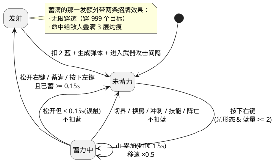
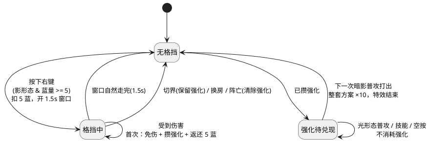
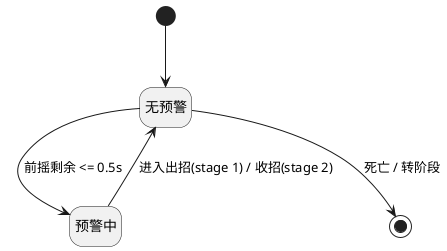

# 《双界行者》形态拓展设计说明书

> 项目状态基线：2026-09-10
> 依据源码：`src/main/java/com/phantomcorridor`（当前工作目录 `d:\rouge\rouge`）
> 配套文档：《双界行者》项目需求说明书、《详细设计说明书》、`01`～`04` 分项交付物
> 后续改动见 `06_结算与隐藏路线更新设计说明书.md`（结算输入统一、隐藏路线形态修复）

---

## 1. 文档说明

| 项 | 内容 |
| --- | --- |
| 目的 | 记录本批「形态拓展」功能的详细设计：需求落点、状态机、方法契约、数值、渲染表现与验证结论 |
| 范围 | 光形态蓄力、影形态格挡、敌人出招预警、结算计时缺陷修复，以及四者的装备适配 |
| 基线 | 当前 `src/main` 源码 + 需求说明书；`.\mvnw.cmd test` 结果 |
| 变更性质 | 纯增量：不改变既有普攻、技能、切界、清房门禁等原有规则 |

本批功能的四条设计决策由人工拍定（见 §3），AI 负责实现、核对与验证（见 §10）。

---

## 2. 需求到设计的映射

| # | 需求原文 | 设计落点（主） | 状态 |
| --- | --- | --- | --- |
| 1 | 光形态右键蓄力，1.5 秒，伤害线性增长到 5 倍 | [Player](file:///d:/rouge/rouge/src/main/java/com/phantomcorridor/model/entity/Player.java#L516-L583) + [PlayerAttackSystem.fireChargedShot](file:///d:/rouge/rouge/src/main/java/com/phantomcorridor/model/combat/PlayerAttackSystem.java#L272-L303) | 完成 |
| 2 | 松开右键 / 蓄满 / 按左键均可发射 | [GameSession.updateStance](file:///d:/rouge/rouge/src/main/java/com/phantomcorridor/model/GameSession.java#L249-L280) | 完成 |
| 3 | 蓄力时移动速度 0.5 倍 | [Player.movementSpeed](file:///d:/rouge/rouge/src/main/java/com/phantomcorridor/model/entity/Player.java#L155-L167) | 完成 |
| 4 | 蓄满可抵消敌人弹幕 | [EnemySystem.clearBulletsWithChargedShots](file:///d:/rouge/rouge/src/main/java/com/phantomcorridor/model/combat/EnemySystem.java#L1786-L1798) | 完成 |
| 4b | 蓄满可无限穿透敌人，并给敌人叠 3 层灼痕 | [PlayerAttackSystem.spawnPellets](file:///d:/rouge/rouge/src/main/java/com/phantomcorridor/model/combat/PlayerAttackSystem.java#L434-L483) + [EnemySystem.applyDamage](file:///d:/rouge/rouge/src/main/java/com/phantomcorridor/model/combat/EnemySystem.java#L1261-L1289) | 完成 |
| 5 | 影形态右键格挡，1.5 秒内无敌 | [Player.beginBlock](file:///d:/rouge/rouge/src/main/java/com/phantomcorridor/model/entity/Player.java#L602-L614) | 完成 |
| 6 | 受击则强化下一次暗影普攻，伤害 ×10 | [Player.takeDamage](file:///d:/rouge/rouge/src/main/java/com/phantomcorridor/model/entity/Player.java#L466-L479) + [PlayerAttackSystem.tryAttack](file:///d:/rouge/rouge/src/main/java/com/phantomcorridor/model/combat/PlayerAttackSystem.java#L305-L340) | 完成 |
| 7 | 屏幕边框渐变特效，攻击后结束 | [GameRenderer.drawBlockFeedback](file:///d:/rouge/rouge/src/main/java/com/phantomcorridor/view/GameRenderer.java#L492-L525)（主题紫） | 完成 |
| 7b | 每次挡下攻击，受击处出现黄色「格挡」小字 | [GameRenderer.drawBlockFlash](file:///d:/rouge/rouge/src/main/java/com/phantomcorridor/view/GameRenderer.java#L527-L550) | 完成 |
| 8 | 两个形态都要做对应装备的适配 | §7 | 完成 |
| 9 | 敌人攻击前 0.5 秒头顶红色感叹号 | [EnemySystem.updateAttackWarning](file:///d:/rouge/rouge/src/main/java/com/phantomcorridor/model/combat/EnemySystem.java#L1769-L1783) + [GameRenderer.drawAttackWarning](file:///d:/rouge/rouge/src/main/java/com/phantomcorridor/view/GameRenderer.java#L444-L456) | 完成 |
| 10 | Bug：穿越完成后用时不会停下 | [GameSession.runTime](file:///d:/rouge/rouge/src/main/java/com/phantomcorridor/model/GameSession.java#L41-L53) | 完成 |

---

## 3. 设计决策（人工拍定）

| 决策点 | 结论 | 理由 |
| --- | --- | --- |
| 格挡窗口语义 | **持续 1.5 秒无敌**；窗口内首次受击授予强化，窗口继续走完 | 容错更高，且「一次窗口只给一次强化」避免了连续挨打无限刷强化 |
| 蓄力伤害基准 | **相对同一次攻击方案 1 → 5 倍**；可短按（最短 0.15 秒） | 蓄力是「当前装备的强化版」，而不是另一套独立攻击；短按≈普攻，玩家不必掐点 |
| 抵消弹幕的时机 | **由发射出去的光弹在飞行中击落**敌方弹幕 | 是「一发清场弹」的空间解，而不是玩家身上的光环；职责落在弹体上更直观 |
| 资源与冷却 | 光蓄力**固定 2 点蓝**；影格挡**需要 5 格蓝**，**格挡成功返还** | 用蓝量而非冷却约束：挡住就不花钱，空放自己承担，鼓励读招 |

数值全部集中在 [GameConfig](file:///d:/rouge/rouge/src/main/java/com/phantomcorridor/config/GameConfig.java#L507-L550)，符合「config 集中管理魔法数值」的分层原则。

---

## 4. 关键数值

| 常量 | 值 | 含义 |
| --- | --- | --- |
| `LIGHT_CHARGE_MAX_TIME` | 1.5 s | 满蓄时间 |
| `LIGHT_CHARGE_MIN_TIME` | 0.15 s | 最短蓄力；低于它视为误触 |
| `LIGHT_CHARGE_MAX_MULTIPLIER` | 5.0 | 蓄满伤害倍率 |
| `LIGHT_CHARGE_MOVE_MULTIPLIER` | 0.5 | 蓄力期间移速倍率 |
| `LIGHT_CHARGE_ENERGY_COST` | 2 | 每次蓄力发射的蓝量 |
| `LIGHT_CHARGE_RADIUS_SCALE` | 1.7 | 蓄力光弹弹体半径倍率 |
| `LIGHT_CHARGE_PIERCE_MAX` | 999 | 蓄满光弹的穿透上限（表达「无限穿透」） |
| `LIGHT_CHARGE_SCORCH_STACKS` | 3 | 蓄满光弹命中时给敌人叠的灼痕层数 |
| `SHADOW_BLOCK_DURATION` | 1.5 s | 格挡无敌窗口 |
| `SHADOW_BLOCK_ENERGY_COST` | 5 | 开启格挡的蓝量 |
| `SHADOW_BLOCK_ENERGY_REFUND` | 5 | 格挡成功的返还量（等于消耗） |
| `SHADOW_BLOCK_EMPOWER_MULTIPLIER` | 10.0 | 强化暗影普攻倍率 |
| `SHADOW_BLOCK_FLASH_TIME` | 0.55 s | 每次挡下攻击后边缘「格挡」提示的显示时长 |
| `ENEMY_ATTACK_WARNING_LEAD` | 0.5 s | 感叹号提前量 |

**伤害公式**（沿用既有乘区，未新增乘区）：

```
蓄力倍率 M = 1 + (5 − 1) × (蓄力时间 / 1.5)          // 线性，封顶 5
暗影强化倍率 N = 10（仅一次）

最终伤害 = 基础伤害 × (段系数 × M 或 N) × (1 + 同类加成之和) × 难度倍率
         → 至少 1 点（Enemy.takeHit 的硬规则）
```

`M`/`N` 都乘在**段系数**上（见 §7），因此武器形态与所有既有加成继续生效。

---

## 5. 状态机设计

### 5.1 光形态蓄力状态机

按住右键进入，蓄满封顶，三种时机任一命中即发射。



| 状态 | 进入条件 | 退出条件 | 行为 |
| --- | --- | --- | --- |
| 未蓄力 | 初始 / 结束 | 按下右键且可用 | 移速正常，右键无副作用 |
| 蓄力中 | [Player.beginCharge](file:///d:/rouge/rouge/src/main/java/com/phantomcorridor/model/entity/Player.java#L555-L567) 返回 true | 发射 / 放弃 | 累加 `chargeTime`（封顶 1.5s）；`movementSpeed()` 乘 0.5；渲染进度环 |
| 发射 | 松开 / 蓄满 / 左键按下，且 `chargeTime ≥ 0.15s` | 立即 | `consumeCharge()` 扣 2 蓝并返回倍率；`fireChargedShot` 生成弹体；写入武器自身攻击间隔 |

**蓄满的两条招牌效果**（`isChargeFull()` 为真时才生效，见 [spawnPellets](file:///d:/rouge/rouge/src/main/java/com/phantomcorridor/model/combat/PlayerAttackSystem.java#L434-L483)）：

| 效果 | 实现 | 说明 |
| --- | --- | --- |
| 无限穿透 | 行为改为 `PIERCE`，`extraHits` 提到 `LIGHT_CHARGE_PIERCE_MAX` | 对所有按方案发出的光弹生效（含三叉杖的三发各自穿透）；**唯一例外是炽核权杖**——它的身份是爆裂（光核本身没有接触伤害），强行改成穿透会退化成一颗普通子弹，所以保留其爆裂行为 |
| 叠满灼痕 | 弹体携带 `scorchStacks = 3`，命中时由 [applyDamage](file:///d:/rouge/rouge/src/main/java/com/phantomcorridor/model/combat/EnemySystem.java#L1261-L1289) 逐层施加 | 普攻一次只叠 1 层，蓄满一发直接叠满（上限仍由 `Enemy` 把关），于是「光界蓄满 → 切影界引爆」成为一条成立的连招 |

**不可进入蓄力的三类情况**（[beginCharge](file:///d:/rouge/rouge/src/main/java/com/phantomcorridor/model/entity/Player.java#L555-L567) 的守卫）：非光形态、已阵亡、蓝量 < 2。已进入蓄力时重复按下不重置进度。

### 5.2 影形态格挡状态机

按下即开窗，窗口内首次受击攒强化，强化在「下一次暗影普攻」上兑现。



| 状态 | 进入条件 | 退出条件 | 行为 |
| --- | --- | --- | --- |
| 无格挡 | 初始 / 窗口结束 | 按下右键且可用 | 正常受击 |
| 格挡中 | [Player.beginBlock](file:///d:/rouge/rouge/src/main/java/com/phantomcorridor/model/entity/Player.java#L602-L614) 返回 true | 窗口走完 / 被清空 | 窗口内**完全免伤**；首次挡下伤害 → 攒强化 + 返还 5 蓝 + 弹出飘字 |
| 强化待兑现 | 首次挡下伤害 | 暗影普攻打出 | 渲染红色渐变边框；不因切界/换房间丢失（切界仅关窗、换房/阵亡清空） |

**强化只在「真的打出那一击」时消耗**：`tryAttack` 在冷却中、施法中、冲刺中会提前返回，此时不取用强化，避免空按白吃。

### 5.3 敌人出招预警状态机



| 状态 | 判定条件 | 渲染 |
| --- | --- | --- |
| 无预警 | 无进行中的施法，或施法已进入 stage 1/2 | 不画 |
| 预警中 | `stage == 0` 且 `0 < windup − animationTime ≤ 0.5s` | 血条上方红底白叹号 + 呼吸 |

### 5.4 无死状态校验

- **蓄力**：每个「蓄力中」都有出口（发射或放弃），不存在只能停在该状态的路径；放弃路径**不扣蓝**，不会造成资源静默损失。
- **格挡**：窗口由 `dt` 递减保证必然归零；强化是**一次性**标记，只能被一次普攻消耗，不会永久滞留。
- **预警**：`stage` 单调推进（0 → 1 → 2 → 结束），必然回到「无预警」；首领转阶段时显式清零，避免残留。

---

## 6. 类与方法级设计

### 6.1 变更清单

| 类 | 变更 | 说明 |
| --- | --- | --- |
| [GameConfig](file:///d:/rouge/rouge/src/main/java/com/phantomcorridor/config/GameConfig.java#L507-L550) | 新增 11 个常量 | 蓄力 / 格挡 / 预警数值 |
| [Player](file:///d:/rouge/rouge/src/main/java/com/phantomcorridor/model/entity/Player.java) | 新增 4 字段 + 16 方法 | 蓄力与格挡状态；移速惩罚；免伤分支 |
| [AttackProfile](file:///d:/rouge/rouge/src/main/java/com/phantomcorridor/model/combat/AttackProfile.java#L96-L111) | 新增 `withCoefficientScale` | 整套方案系数整体缩放 |
| [Projectile](file:///d:/rouge/rouge/src/main/java/com/phantomcorridor/model/combat/Projectile.java#L184-L189) | 新增 `clearsEnemyBullets` | 标记蓄力光弹的击落能力 |
| [PlayerAttackSystem](file:///d:/rouge/rouge/src/main/java/com/phantomcorridor/model/combat/PlayerAttackSystem.java) | 抽出 `resolveAttack`；新增 `fireChargedShot`；`tryAttack` 支持强化 | 装备适配的核心 |
| [Enemy](file:///d:/rouge/rouge/src/main/java/com/phantomcorridor/model/entity/Enemy.java#L338-L346) | 新增 `attackWarning` | 预警标记 |
| [EnemySystem](file:///d:/rouge/rouge/src/main/java/com/phantomcorridor/model/combat/EnemySystem.java) | 新增 `updateAttackWarning` / `clearBulletsWithChargedShots` | 预警写入与弹幕击落 |
| [GameSession](file:///d:/rouge/rouge/src/main/java/com/phantomcorridor/model/GameSession.java) | 新增 `runTime` / `updateStance` / `setSecondaryHeld` | 输入编排、资源结算、计时修复 |
| [GameController](file:///d:/rouge/rouge/src/main/java/com/phantomcorridor/controller/GameController.java#L23-L25)、[GameView](file:///d:/rouge/rouge/src/main/java/com/phantomcorridor/view/GameView.java#L113-L116) | 右键按下/松开上报 | 输入层只上报状态，不解释玩法 |
| [GameRenderer](file:///d:/rouge/rouge/src/main/java/com/phantomcorridor/view/GameRenderer.java) | 新增 4 个绘制方法；改造技能图标 HUD | 感叹号、进度环、格挡边框与「格挡」提示；图标下冷却与压深 |

### 6.2 核心方法契约

| 类 | 方法签名 | 参数 | 返回 | 前置条件 | 后置条件 | 设计落点 |
| --- | --- | --- | --- | --- | --- | --- |
| `Player` | `boolean beginCharge()` | — | 是否进入蓄力 | 光形态、存活、未在蓄力、蓝量 ≥ 2 | 成功：`charging=true`、`chargeTime=0`、清除普攻动作；失败：状态不变、不扣蓝 | 蓄力起手守卫 |
| `Player` | `double consumeCharge()` | — | 本次伤害倍率 | 正在蓄力 | `charging=false`；扣 `LIGHT_CHARGE_ENERGY_COST`；返回 `1+(5−1)×ratio` | 发射结算单点 |
| `Player` | `double chargeDamageMultiplier()` | — | 1～5 | — | 纯查询，无副作用 | 数值口径 |
| `Player` | `boolean beginBlock()` | — | 是否开窗 | 影形态、存活、未在窗口、蓝量 ≥ 5 | 成功：扣 5 蓝、`blockRemaining=1.5` | 格挡起手 |
| `Player` | `DamageResult takeDamage(double, DamageType, double, double)` | 伤害、类型、来源坐标 | 结算明细；未生效返回 `null` | — | **格挡优先于无敌帧**：窗口内完全免伤；首次挡下 → `blockEmpower=true` + 返还 5 蓝；返回「全部被吸收」的明细 | 免伤 + 强化授予 |
| `Player` | `boolean consumeBlockEmpower()` | — | 是否取到强化 | — | 取到即清除（一次性） | 强化兑现 |
| `AttackProfile` | `AttackProfile withCoefficientScale(double)` | 倍率 | 新方案（不可变） | — | 所有段系数 ×倍率；`1.0` 时返回自身 | 整套方案缩放 |
| `PlayerAttackSystem` | `ResolvedAttack resolveAttack(Player)` | 玩家 | 有效方案 + 对应武器 | `player != null` | 把「装备栏 + 当前世界」翻译成可执行方案；普攻与蓄力共用 | 装备适配唯一入口 |
| `PlayerAttackSystem` | `boolean fireChargedShot(Player, double, double, double)` | 玩家、瞄准点、倍率 | 是否打出 | 光形态、存活、非施法/冲刺 | 方案系数 ×倍率；弹体半径 ×1.7 且带击落标记；写武器间隔 | 蓄力发射 |
| `EnemySystem` | `void updateAttackWarning(Enemy)` | 敌人 | — | — | `stage==0` 且剩余前摇 ≤ 0.5s → 标记为真，否则为假 | 预警写入 |
| `EnemySystem` | `void clearBulletsWithChargedShots(PlayerAttackSystem)` | 玩家攻击系统 | — | — | 蓄力光弹接触到的**可清除**敌弹 `expire()`；光弹自身继续飞 | 抵消弹幕 |
| `GameSession` | `void updateStance(boolean attacking)` | 左键是否按住 | — | — | 右键边沿 → 起手/开窗/放弃；左键按下边沿在蓄力中触发发射 | 玩法规则（不进输入层） |
| `GameSession` | `void setSecondaryHeld(boolean)` | 右键是否按住 | — | — | 只存状态，边沿由 `updateStance` 判定 | 输入上报 |
| `GameSession` | `double getRunTime()` | — | 本局实际用时 | — | 仅在本局未结束时累计 | 结算计时 |

### 6.3 每帧调用顺序（GameSession.update）

```
visualTime += dt ; 本局未结束则 runTime += dt
worldShift.update(dt)
死亡/通关 → 取消蓄力与格挡 → 仅推进动画与冲刺计时 → return
aimX/aimY ← 输入
updateStance(attacking)          ← 蓄力会改移速，必须早于移动
navigation.move / dash
房间切换 → 取消蓄力、清空格挡
attackSystem.update → abilities.update → enemies.update
  └ enemies.update 内：写预警 → advanceCast → … → clearBulletsWithChargedShots → updateEnemyAttacks
attacking && !施法中 && !蓄力中 → attackSystem.tryAttack()
player.updateAnimation(...)      ← 在这里推进蓄力/格挡计时（暂停即冻结）
```

顺序上有一处**硬约束**：`clearBulletsWithChargedShots` 必须早于 `updateEnemyAttacks`，否则同帧内本该被击落的弹体仍会先结算一次命中。

---

## 7. 装备适配设计

**核心思路：蓄力/强化不新增攻击方式，只放大「当前这一套」。**

```
装备栏 + 当前世界
      │ resolveAttack()          ← 唯一入口
      ▼
  AttackProfile[]（三叉杖三向 / 长杖穿透 / 法球弹射 / 炽核爆裂 / 重剑前摇…）
      │ withCoefficientScale(M 或 N)
      ▼
  执行（spawnPellets / openMelee）
      │
      ▼
  EnemySystem.applyDamage：× (1 + 同类加成) × 难度倍率 → 至少 1 点
```

| 形态 | 适配点 | 效果 |
| --- | --- | --- |
| 光·蓄力 | 沿用当前光界武器方案 | 三叉杖蓄满仍是三向、贯日长杖蓄满仍是穿透、炽核权杖蓄满仍是爆裂；晨曦法杖的弹速加成照常生效 |
| 光·蓄力 | 沿用光界伤害加成与攻击间隔 | 凝光透镜 +25%、晨曦法杖/圣印、道具光加成全部计入；发射后进入该武器自身间隔 |
| 影·强化 | 沿用当前影界武器方案 | 夜坠重剑仍是 40° 前摇重劈、环月镰仍是 360° 环斩、归影双刃仍是往返 |
| 影·强化 | 沿用影界伤害加成 | 影牙短刃 +20%、猎影牙饰（>70% 生命 +25%）、道具影加成全部计入 |

**装备栏为空**时退回该界基础方案（`baseLight` / `baseShadow`），因此零装备也能用这两套机制。

> 一处刻意的取舍：蓄力弹**一次放出全部弹丸**（不拆分蚀界仪的二连发间隔）。蓄力是一发整体打出的重击，拆成两颗会让「蓄满的分量」读不出来。

---

## 8. 渲染表现

| 表现 | 触发 | 画法 | 位置 |
| --- | --- | --- | --- |
| 蓄力进度环 | `player.isCharging()` | 角色脚下实心细环 + 从 12 点顺时针填充的金色圆弧；蓄满加一层外发光 | [drawChargeIndicator](file:///d:/rouge/rouge/src/main/java/com/phantomcorridor/view/GameRenderer.java#L469-L486) |
| 格挡边框 | `player.hasBlockEmpower()`（**格挡成功**才亮） | 四边各一层向内的**主题紫**（`SHADOW_VIOLET`）线性渐变，随模拟时钟呼吸；强化被那一次暗影普攻兑现后立即熄灭 | [drawBlockFeedback](file:///d:/rouge/rouge/src/main/java/com/phantomcorridor/view/GameRenderer.java#L492-L525) |
| 「格挡」提示 | `player.getBlockFlashRatio() > 0` | 在**受击处**冒出的**黄色**「格挡」小字（17 px，先描暗色底），每次挡下重新点燃并向上飘散淡出 | [drawBlockFlash](file:///d:/rouge/rouge/src/main/java/com/phantomcorridor/view/GameRenderer.java#L527-L550) |
| 出招警示 | `enemy.isAttackWarning()` | 血条上方红底白叹号（`!`），轻微缩放呼吸 | [drawAttackWarning](file:///d:/rouge/rouge/src/main/java/com/phantomcorridor/view/GameRenderer.java#L444-L456) |
| 技能冷却与可用性 | 每帧 | 图标下方显示「按键 + 剩余冷却秒数」（无冷却时只显示按键）；冷却与缺蓝时给图标压一层暗色 | [drawAbilityHudIcons](file:///d:/rouge/rouge/src/main/java/com/phantomcorridor/view/GameRenderer.java#L2394-L2446) |
| 受击飘字 | 格挡挡下伤害 | 复用「护盾吸收」通道，飘出被挡下的点数 | `EnemySystem.recordPlayerHit` |

边框配色与影界同色系（`SHADOW_VIOLET = #9b65dc`），与光界的金色 `LIGHT_GOLD` 区分；「格挡」提示用黄色（`#ffd54a`）而非边框紫，是为了让「发生了一次格挡」这件事在紫色边框上依然跳得出来。冷却秒数用暖黄 `#ffd166`，与白色按键标签区分。

三条纪律：

1. **渲染层不做计时**：是否显示完全由模型给出（`isAttackWarning()` 等），暂停时符号与窗口一起冻结，不会出现「游戏停了、感叹号还在闪」。
2. **呼吸相位取自模拟时钟**：`animationTime` / `session.getVisualTime()`，不用现实时间，保证可复现。
3. **不遮挡关键信息**：边框用渐变而非实线，不挡屏幕边缘的弹幕与 HUD。

操作提示同步更新为「左键普攻 · 右键 蓄力/格挡 · …」（[drawControls](file:///d:/rouge/rouge/src/main/java/com/phantomcorridor/view/GameRenderer.java#L2442-L2449)）。

---

## 9. 缺陷修复：《穿越完成后用时不会停下》

### 9.1 现象与根因

通关结算界面（`穿 越 完 成`）上的「用时」持续增长，不会停在通关那一刻。

根因在 [GameSession.update](file:///d:/rouge/rouge/src/main/java/com/phantomcorridor/model/GameSession.java#L142-L159) 的语句顺序：

```java
visualTime += Math.max(0, dt);          // ① 无条件累加（在结束判定之前）
...
if (player.getHp() <= 0 || runCleared) { ... return; }   // ② 本局已结束才提前返回
```

`visualTime` 同时承担了**两个语义**：

| 语义 | 使用方 | 是否应当在本局结束后继续走 |
| --- | --- | --- |
| 动画模拟时钟 | 传送门流光、相位脉冲、边框呼吸 | **应当**继续（否则通关画面会僵住） |
| 本局用时 | 死亡/通关结算界面 | **不应当**（这就是缺陷） |

一个变量承载两种语义，且累加点在结束判定之前，导致结算数字被动画时钟带着一直涨。

### 9.2 修复方案

拆出独立字段 `runTime`，只在**本局未结束**时累计：

```java
visualTime += Math.max(0, dt);                            // 动画时钟：不变
if (player.getHp() > 0 && !runCleared) runTime += dt;      // 本局用时：结束即停
```

两个结算界面改用 `getRunTime()`（[formatDuration(session.getRunTime())](file:///d:/rouge/rouge/src/main/java/com/phantomcorridor/view/GameRenderer.java)），`visualTime` 保持原用途。

**为什么不用「结束就停止整个 update」的方案**：那会同时冻结传送门流光、相位脉冲与边框呼吸，通关画面变成静止帧；而且 `GameController` 在结算态仍需处理 `R`/`M` 按键与渲染。分离语义比一刀停掉更新更小、更安全。

### 9.3 验证

`GameSessionTest.runTimerStopsOnceTheRunIsOver`：

1. 跑 30 帧，断言 `runTime > 0`（正常在累计）；
2. 打死玩家 → 记录 `runTime`；
3. 再跑 120 帧，断言 `runTime` **完全不变**，同时断言 `visualTime` **仍在增长**（证明两者已解耦）。

---

## 10. AI 使用与核对说明

| 环节 | AI 工作 | 人工核对 | 结论 |
| --- | --- | --- | --- |
| 需求拆解 | 把 5 条需求映射到类与文件，标注既有可复用机制（切界脉冲的清弹规则、`applyDamage` 乘区、`ActiveCast` 阶段机） | 确认映射与改动范围 | 通过 |
| 方案提问 | 提出 4 个影响手感/平衡的决策点及推荐值 | **人工选定**：持续 1.5s 无敌 / 1→5 倍可短按 / 弹体击落 / 2 蓝与 5 蓝 | 通过 |
| 代码实现 | 生成 11 个主源文件 + 3 个测试文件的增量改动（约 660 行） | 逐文件复核分层与命名 | 通过 |
| 编译验证 | `mvnw -o compile` | 复核结论 | 0 错误 |
| 缺陷发现① | 首次全量测试暴露 **`List.copyOf` 拒绝 `null` 元素** 的 NPE：`resolveAttack` 在「无形态武器」时会放入 `null` | 定位到 `resolveAttack` 返回值构造 | **已修正**：改用 `Collections.unmodifiableList` 并注释原因 |
| 缺陷发现② | 自建用例踩到浮点边界：窗口按浮点秒数倒数，恰好卡在末帧会残留 1e-16 | 复核为测试过紧而非实现缺陷 | **已修正**测试推进量 |
| 既有失败甄别 | 全量 288 用例中 11 条失败，逐条比对**代码当前行为**与**测试期望** | 确认与本次改动无关 | 记录于 §11.3，未擅自改动 |
| 行为验证 | 静态与单测覆盖；图形环境未启动 | — | 待人工实操确认手感 |

---

## 11. 测试与验证

### 11.1 新增用例

| 用例 | 覆盖点 |
| --- | --- |
| `PlayerStanceTest`（11 条） | 伤害线性 1→3→5、移速 ×0.5、蓝量不足起手、最短蓄力、固定扣 2 蓝、蓄力只在光形态 |
| | 格挡扣 5 蓝、免伤 + 攒强化 + 返还、窗口到点失效、**一次窗口只返还/只攒一次**、蓝量不足、只在影形态 |
| `GameSessionTest`（+3 条） | 按住右键蓄力 → 松开发射，扣 2 蓝、弹体带击落标记，且**未蓄满不是穿透弹**；按住到蓄满自动发射，弹体为穿透 + 带满层灼痕载荷；本局结束后 `runTime` 停住而 `visualTime` 继续 |
| `EnemySystemTest`（+2 条） | 感叹号只在出招前 0.5 秒内出现、出招后立即熄灭；蓄满弹命中后目标**灼痕直接满层**，且弹体可连续穿透多个目标 |

### 11.2 执行结果

```text
.\mvnw.cmd -o test
Tests run: 290, Failures: 11, Errors: 0, Skipped: 1
```

本次新增的 16 条用例**全部通过**；`AccessoryEffectTest`（16 条）曾在改动中途因缺陷①失败，修正后恢复全绿。

后续一批「UI 反馈」改动（格挡紫色边框、受击处黄色「格挡」提示、技能图标下的冷却与压深）为纯渲染与 HUD 调整，不新增用例：本工程的渲染层依赖图形环境、不纳入单测，以全量 `mvnw -o test` 回归确认无破坏（失败数仍为 11 条既有项）。观感与手感需人工在 `javafx:run` 下确认。

### 11.3 既有失败清单（与本次改动无关，建议单独排期）

| 测试类 | 条数 | 根因 |
| --- | --- | --- |
| `RoomContentSystemTest` | 8 | 交互键已由 `E` 改为 `F`，断言文案仍写 `E  拾取/购买/开箱` |
| `PlayerAbilitySystemTest` | 2 | `FINISHER_PHASE_COST` 已由 100 改为 80，断言仍按满能量 |
| `WeaponAttackProfileTest` | 1 | 已改为「同界多把武器同时出手」，断言仍按「只启用优先级最高的一件」 |

---

## 12. 已知边界与后续可调项

| 项 | 现状 | 可调方向 |
| --- | --- | --- |
| 格挡无独立冷却 | 仅由 5 格蓝约束（满蓝≈连开 3 次） | 需要时加 `SHADOW_BLOCK_COOLDOWN` |
| 蓄力被打断不扣蓝 | 只有「真正打出」才扣 2 蓝 | 若要更硬核，改为起手即扣 |
| 蓄力无独立冷却 | 发射后进入该武器自身攻击间隔 | 可加独立的蓄力冷却 |
| 蓄力弹可击落多枚 | 光弹中途不会因击落而消失（一发清场） | 可加「击落上限」或击落后衰减 |
| 强化跨切界保留 | 切界只关窗、不丢强化 | 若要更严，可改为切界即清 |
| 预警仅覆盖前摇类招式 | 依赖 `ActiveCast` 的 stage 0 | 纯地面预警类招式可用 `EnemyTelegraph` 自带倒计时 |
| 图形表现 | 未在图形环境启动验证 | 需人工实操确认手感与观感 |
