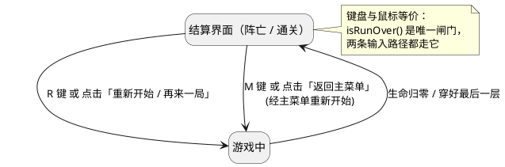

# 《双界行者》更新设计说明书（结算交互 · 隐藏路线）

> 项目状态基线：2026-09-10
> 依据源码：`src/main/java/com/phantomcorridor`（当前工作目录 `d:\rouge\rouge`）
> 配套文档：《双界行者》详细设计说明书、`05_形态拓展设计说明书`（上一批功能）

---

## 1. 文档说明

| 项 | 内容 |
| --- | --- |
| 目的 | 记录本批两项改动的详细设计：结算界面的输入统一、隐藏路线的进入形态修复 |
| 范围 | ① 结算（阵亡 / 通关）同时支持键盘与鼠标；② 隐藏房不再恒为影形态，并在地图上标出所需形态 |
| 变更性质 | ① 交互层补齐 + 消除重复几何；② 缺陷修复（写死形态） |
| 与 `05` 的关系 | `05` 记录形态右键机制（蓄力 / 格挡 / 出招预警 / 结算计时），本文件记录其后的两项改动，互不重叠 |

---

## 2. 需求到设计映射

| # | 需求 | 设计落点 | 状态 |
| --- | --- | --- | --- |
| 1 | 结算时除了 R / M 按键，还可以用鼠标点击 | [GameController.isRunOver / pointerClicked](file:///d:/rouge/rouge/src/main/java/com/phantomcorridor/controller/GameController.java#L201-L219) + [SettlementButtons](file:///d:/rouge/rouge/src/main/java/com/phantomcorridor/view/SettlementButtons.java) | 完成 |
| 2 | 修复"隐藏房间只能暗形态进入" | [MapGenerator](file:///d:/rouge/rouge/src/main/java/com/phantomcorridor/model/dungeon/MapGenerator.java#L52-L60) | 完成 |
| 2b | （随 ② 一并）地图上标出该隐藏房需要哪种形态 | [GameRenderer.drawHiddenExit](file:///d:/rouge/rouge/src/main/java/com/phantomcorridor/view/GameRenderer.java#L251-L295) | 完成 |

**设计决策（人工拍定）**：隐藏路线保留「形态限定」这一设计，但**改为按种子随机指定光或影**，而不是取消限制。
（曾评估的另一种方案是「取消形态限制、两种形态都能进」，最终未采用。）

---

## 3. 结算界面：键盘与鼠标统一

### 3.1 改前的问题

两个结算界面的交互模型是**互斥**的，各自缺一半：

| 界面 | 改前 | 缺口 |
| --- | --- | --- |
| 阵亡 | 只能鼠标点按钮 | 按 R / M 无效（`keyPressed` 开头遇 `hp <= 0` 直接 return） |
| 通关 | 只能按 R / M | **没有按钮，点击被静默忽略** |

通关侧的"点了没反应"是显性缺陷：命中判定入口写的是

```java
if (session.getPlayer().getHp() > 0) return;   // 通关时 hp > 0 → 直接返回
```

它只认"阵亡"，把"通关"整个漏掉了。

### 3.2 设计

**一个判定闸门 + 一份几何来源。**



| 决策 | 理由 |
| --- | --- |
| 抽 `isRunOver() = 通关 \|\| 阵亡` 作为唯一闸门 | 两条输入路径（键盘、鼠标）共用同一个"本局是否结束"判断，不会再出现一边认、另一边不认 |
| 按钮矩形收敛到 `SettlementButtons` | 改前坐标同时写在渲染器与控制器里（`centerX - 170, centerY + 44, 140, 50` vs `x >= centerX - 170 && x <= centerX - 30`），改一处就会"看到的位置"与"点得中的位置"错位 |
| 悬停与命中共用同一个 `button.contains(...)` | 保证"看起来指着哪颗"与"点下去是哪颗"必然一致 |
| 两个界面都写出快捷键提示 | 玩家不必先猜"这一屏认哪个输入" |

### 3.3 方法契约

| 类 | 方法签名 | 参数 | 返回 | 前置条件 | 后置条件 | 设计落点 |
| --- | --- | --- | --- | --- | --- | --- |
| `SettlementButtons` | `record Button(double x, double y, double width, double height)` | 左上角与尺寸（逻辑坐标） | — | — | 不可变值对象 | 几何单一来源 |
| `SettlementButtons.Button` | `boolean contains(double px, double py)` | 画布坐标 | 是否命中 | — | 纯函数，闭区间判定 | 渲染悬停 + 输入命中 |
| `SettlementButtons` | `static final Button RESTART / MAIN_MENU` | — | 两颗按钮 | — | 以 `AppConfig` 视口尺寸为基准，关于中线对称 | 唯一坐标定义 |
| `GameController` | `boolean isRunOver()` | — | 本局是否结束 | — | `isRunCleared() \|\| getHp() <= 0` | 结算输入闸门 |
| `GameController` | `void pointerClicked(double x, double y)` | 点击的逻辑坐标 | — | — | 未结束时直接返回；命中则重开或回主菜单 | 鼠标路径 |
| `GameRenderer` | `void drawSettlementButton(g, session, button, label, menu)` | 图形上下文、会话、按钮几何、文案、是否"返回主菜单" | — | `button != null` | 按 `button.contains(aimX, aimY)` 决定悬停样式 | 阵亡与通关共用画法 |

### 3.4 布局

| 项 | 值 |
| --- | --- |
| 按钮尺寸 | 140 × 50 |
| 垂直位置 | 视口中线 + 44 |
| 「重新开始 / 再来一局」 | 中线 −170 起（右缘距中线 30） |
| 「返回主菜单」 | 中线 +30 起（左缘距中线 30） |
| 对称性 | 两颗按钮关于屏幕中线对称，中间留 60 px 空隙 |
| 通关界面文案 | 标题 −92 / 副标题 −54 / 战绩 −22 / 按钮 +44 / 快捷键提示 +120 |

通关界面整体上移，是给按钮腾出位置；文字与按钮不再互相压盖（由 `SettlementButtonsTest` 钉住"按钮必须在中心线下方"）。

---

## 4. 隐藏路线：进入形态修复

### 4.1 根因

[MapGenerator](file:///d:/rouge/rouge/src/main/java/com/phantomcorridor/model/dungeon/MapGenerator.java#L52-L60) 生成隐藏路线时把形态**写死**：

```java
room.configureHiddenRoute(WorldType.SHADOW, direction.opposite());   // 永远是影
```

而 [`RoomNavigationSystem.transition`](file:///d:/rouge/rouge/src/main/java/com/phantomcorridor/model/room/RoomNavigationSystem.java#L208-L214) 会拿它和玩家当前世界比对，不匹配即拒绝跨门：

```java
if (target.requiredEntryForm() != null
        && target.requiredEntryForm() != player.getCurrentWorld()) return;
```

于是所有隐藏房都只认暗形态——机制本身没问题，是**配置永远只给一个值**。

### 4.2 设计

形态由该层种子派生，光与影都可能：

```java
boolean lightForm = new Random(seed * 0x9E3779B97F4A7C15L + id).nextBoolean();
room.configureHiddenRoute(lightForm ? WorldType.LIGHT : WorldType.SHADOW, direction.opposite());
```

| 决策 | 理由 |
| --- | --- |
| **另开一条随机流**，不复用地图生成用的 `random` | 复用会多消耗一个随机数，导致后面每个房间的布局与类型整体错位，**已有种子的地图会被悄悄改写**。独立派生种子既不动既有地图，又保证同种子同结果 |
| 形态挂在隐藏房自身（`Room.configureHiddenRoute`） | 沿用既有数据模型：出口只记"通向哪一行"，"需要什么形态"由目标房间声明 |
| 选择随机而非取消限制 | 保留「形态限定」的设计意涵——隐藏路线仍是一次切界决策，只是不再恒为影 |

### 4.3 分布与可复现性（实测）

一张地图只有一间隐藏房（`hidden = id == RoomConfig.DEFAULT_ROOM_COUNT - 2`，即 9 间里的第 7 间），因此"一张图内多间隐藏房形态不一致"不存在；差异只发生在**同一局的层与层之间**（每层种子为 `runSeed + (floor-1) × FLOOR_SEED_STEP`）。

1000 个 runSeed × 5 层实测：

| 指标 | 实测 | 理论 |
| --- | --- | --- |
| 隐藏房要求光形态 | 48.6%（2429 / 5000） | 50% |
| 整局 5 层恰好同形态 | 7.3%（73 / 1000） | 6.25% |

- **层间通常不同**：前 20 个种子里 18 个层间形态不同；
- **偶尔全同**：`runSeed = 9` 得到 `L L L L L`、`runSeed = 18` 得到 `S S S S S`，属正常概率事件，非缺陷；
- **可复现**：同一 runSeed + 同一层永远同形态。

### 4.4 形态提示

形态限定若不给提示，玩家只能撞门才知道，所以三处标记统一按**所需形态**着色（沿用两界主题色）：

| 位置 | 说明 |
| --- | --- |
| 房间内的隐藏出口菱形 | [drawHiddenExit](file:///d:/rouge/rouge/src/main/java/com/phantomcorridor/view/GameRenderer.java#L251-L277) |
| 迷你地图上"这里有隐藏门"的圆点 | 同色，已访问房间才画 |
| 隐藏房自身的 `◇` 图标 | 走进过之后用于回忆该房当初要哪种形态 |

配色取值：光界金 `LIGHT_GOLD = #e8bd68`、影界紫 `SHADOW_VIOLET = #9b65dc`，与现有世界徽标、Boss 血条同一套色系。

> 注意：房间内的出口菱形读的是**目标房间**的形态配置（[requiredFormOf](file:///d:/rouge/rouge/src/main/java/com/phantomcorridor/view/GameRenderer.java#L279-L290)），因为要求形态挂在隐藏房自己身上，而不是出口所在的房间。

---

## 5. 类与方法变更清单

| 类 | 变更 | 说明 |
| --- | --- | --- |
| [SettlementButtons](file:///d:/rouge/rouge/src/main/java/com/phantomcorridor/view/SettlementButtons.java) | **新增** | 两颗结算按钮的唯一几何定义 + 命中判定；纯几何，不引用 JavaFX |
| [GameController](file:///d:/rouge/rouge/src/main/java/com/phantomcorridor/controller/GameController.java#L110-L116) | 改 | 键盘分支与点击分支统一走 `isRunOver()`；移除 `AppConfig` 依赖 |
| [GameRenderer](file:///d:/rouge/rouge/src/main/java/com/phantomcorridor/view/GameRenderer.java#L1258-L1304) | 改 | `drawDeathButton` → `drawSettlementButton`（收按钮几何）；通关界面补按钮并重排；两个界面都补快捷键提示 |
| [MapGenerator](file:///d:/rouge/rouge/src/main/java/com/phantomcorridor/model/dungeon/MapGenerator.java#L52-L60) | 改 | 隐藏路线形态由种子派生，不再写死 SHADOW |
| [GameRenderer](file:///d:/rouge/rouge/src/main/java/com/phantomcorridor/view/GameRenderer.java#L251-L295) | 改 | 隐藏出口与隐藏房标记按所需形态着色（新增 `requiredFormOf` / `hiddenRouteColor`） |

未改动：`Room`、`RoomNavigationSystem`、`RoomContentSystem` 的隐藏路线机制本身（形态检查、隐藏奖励只结算一次等规则原样保留）。

---

## 6. AI 使用与核对说明

| 环节 | AI 工作 | 人工核对 | 结论 |
| --- | --- | --- | --- |
| 缺陷定位 | 追出通关点击失效的守卫条件（`getHp() > 0` 提前返回）、隐藏房形态写死点 | 确认两处根因 | 通过 |
| 方案提问 | 隐藏路线给出「取消形态限制」与「按种子随机指定」两个方向及取舍 | **人工选定**：保留形态限定、随机指定 | 通过 |
| 代码实现 | 新增 1 个类、改 4 个文件 | 逐文件复核分层（几何落在 view、判定落在 controller、配置落在 model） | 通过 |
| 数据核对 | 用临时脚本实测形态分布（48.6% / 7.3% 全同），核对是否符合预期概率 | 复核为正常概率、非退化 | 通过（脚本已删除，未留仓库） |
| 回归验证 | 全量 `mvnw -o test` | 复核结论 | 通过 |
| 边界确认 | 「一张图内是否可能出现多间隐藏房形态不一致」 | 确认每图仅一间隐藏房 | 不适用 |

---

## 7. 测试与验证

### 7.1 新增 / 改写用例

| 用例 | 覆盖点 |
| --- | --- |
| `SettlementButtonsTest`（5 条） | 中心必命中、两按钮不重叠且中间留有真空隙、关于中线对称、都在画布内、都排在中心线下方（不压结算文案） |
| `HiddenRouteTest.hiddenRoutesRequireBothFormsAcrossSeeds`（**新增**） | 60 个种子内光与影都出现过——旧代码在这条上必然失败，锁住该缺陷不回归 |
| `HiddenRouteTest.wrongFormDoesNotEnterAndCorrectFormCrossesTheHiddenDoor`（改写） | 改为**两种形态各跑一遍**：先切到错的那个撞门（应被拒绝且不锁死），再切到对的那个（应成功进入） |
| `HiddenRouteTest.generatedHiddenRouteIsStableAndDoesNotReplaceBoss`（改写） | 删掉 `assertEquals(SHADOW, ...)` 的硬编码预期，改为断言"形态非空 + 同种子同结果" |

### 7.2 执行结果

```text
.\mvnw.cmd -o test
Tests run: 309, Failures: 0, Errors: 0, Skipped: 1
```

其中 `HiddenRouteTest` 4 条、`SettlementButtonsTest` 5 条全部通过。

**关于此前的 11 条既有失败**：那批失败（交互键提示 `E`→`F`、终结技门槛 100→80、多武器同时出手）在本批之前已由团队提交 `ec5396e`（修复多武器攻击回归、装备图标映射及清房弹幕残留）修正，如今全量套件为 0 失败。本批未改动那些测试。

### 7.3 未纳入单测的部分

渲染层依赖图形环境，不纳入单测：按钮的观感（悬停高亮、配色）、菱形标记在影界地面上的对比度、通关界面重排后的视觉平衡，都需要人工在 `javafx:run` 下确认。

---

## 8. 已知边界与后续可调项

| 项 | 现状 | 可调方向 |
| --- | --- | --- |
| 隐藏路线形态粒度 | 每层独立随机（整局 5 层偶尔全同，实测 7.3%） | 若要"整局统一"→ 改用 `runSeed` 派生；若要"整局必然各半"→ 按层号奇偶指定 |
| 隐藏房数量 | 每图固定 1 间（`DEFAULT_ROOM_COUNT - 2`） | 若允许多间，需重新考虑"同图内形态是否要统一" |
| 形态提示 | 房间内菱形 + 迷你地图标记按形态着色 | 可再加文字（如"需影形态"）或图标形状区分，便于色弱玩家 |
| 结算按钮 | 固定两颗，几何为常量 | 若后续加入第三项（如"查看本局统计"），应把布局改为按数量均分 |
| 通关 / 阵亡界面 | 两套文案与排版各自维护 | 若差异继续扩大，可抽出统一的结算面板渲染入口 |
